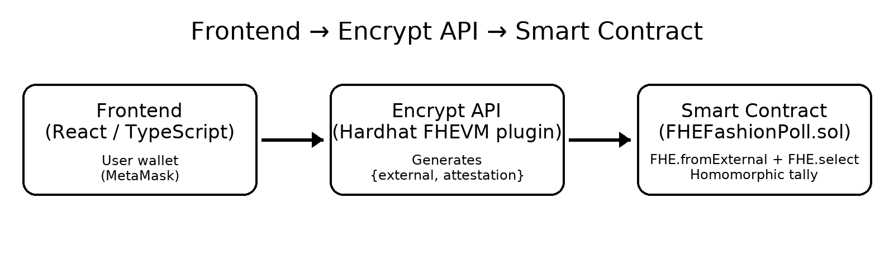

# FHE Fashion Poll


FHEFashionPoll — Confidential voting on Zama fhEVM
==================================================

This repository contains a minimal “Yes/No” confidential voting dApp built on Zama’s fhEVM. Votes are stored encrypted on-chain and tallied homomorphically, so individual choices remain private while totals update securely.  
Live demo link: https://fhe-fashion-poll.vercel.app/

Contract: 0xbE6962010697f1B914166209a0E5B18A56bf5708

Highlights
----------
- Solidity + `@fhevm/solidity`: encrypted types (euint/ebool) and safe homomorphic updates
- Client-side attestation (input-proof) with `@zama-fhe/relayer-sdk`
- Simple Next.js UI (MetaMask)
- Hardhat for development and deployment
Architecture Diagram 


Quick start
-----------
Requirements: Node 20+, MetaMask, Sepolia test ETH (to vote from the UI).

1) Install

```bash
cd fhe-fashion-poll/frontend
npm install --ignore-scripts
```

2) Deploy contract (Sepolia)

```bash
cd ..
npx hardhat compile
npx hardhat run deploy/deploy.ts --network sepolia
```

3) Wire the frontend

Copy the deployed address into `frontend/packages/site/abi/FHEFashionPollAddresses.ts` under Sepolia.

4) Run the UI (development)

```bash
cd frontend/packages/site
npx next dev -p 3001
# Browser: http://localhost:3001 (MetaMask network: Sepolia)
```

Alternative: local Hardhat node

```bash
# Terminal 1
cd fhe-fashion-poll/frontend
npm run hardhat-node

# Terminal 2
cd fhe-fashion-poll/frontend
npm run -w packages/site dev:mock
```

How to vote
-----------
1. Connect MetaMask and switch to Sepolia.
2. Click “Yes” or “No”. Each address can vote once per contract instance.
3. “Encrypted Tallies” shows encrypted handles for the totals.

Common issues
-------------
- `execution reverted: Already voted`: The same address tried to vote again. Use a different account.
- “unknown custom error”: Usually a transient attestation/caching issue. Refresh, reconnect MetaMask, wait a couple of seconds, and try again.

Tech stack
----------
- Solidity, Hardhat, Ethers v6
- Zama fhEVM: `@fhevm/solidity`, `@zama-fhe/relayer-sdk`
- Next.js (React) UI

Zama FHE Developer Program (brief)
----------------------------------
Zama’s Developer Program supports builders shipping confidential apps on fhEVM. In the Builder Track, submit a complete demo (contract + UI) and get reviewed monthly.

- Program criteria & submission: `https://docs.zama.ai/programs/developer-program`
- Community: `https://guild.xyz/zama/developer-program`
- Inspiration/bounties: `https://www.zama.ai/post/zama-bounty-program-season-10-create-a-hello-fhevm-tutorial`

Tip: Submissions should be reproducible end‑to‑end (deploy + run the UI). This repo is intentionally small so you can extend it quickly.

License
-------
See the license file at the repository root.
